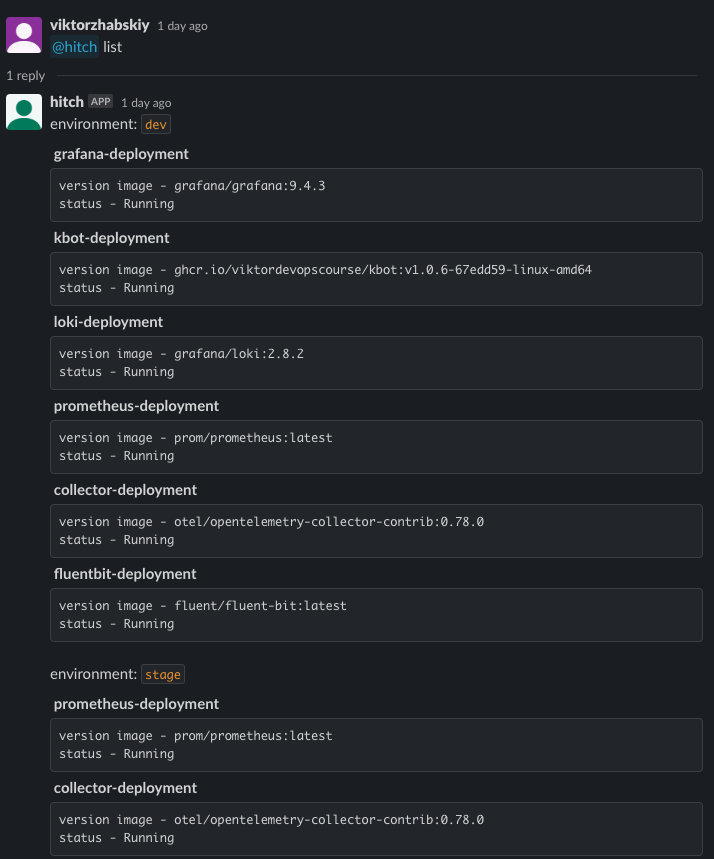
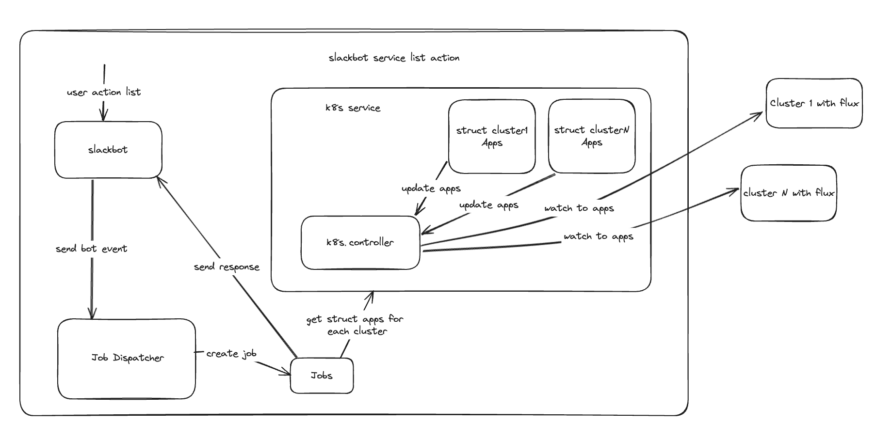
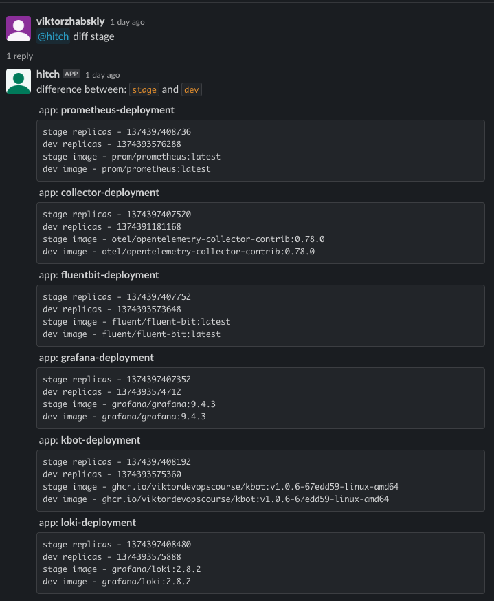
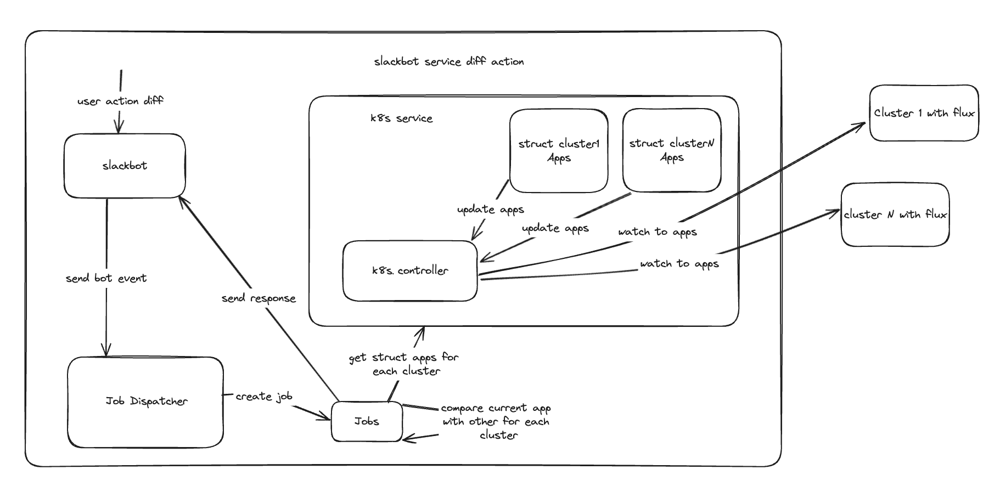
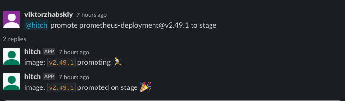
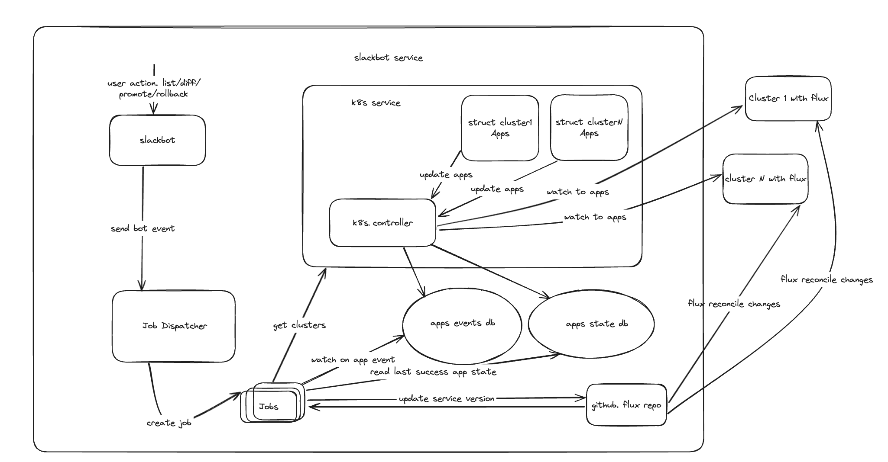
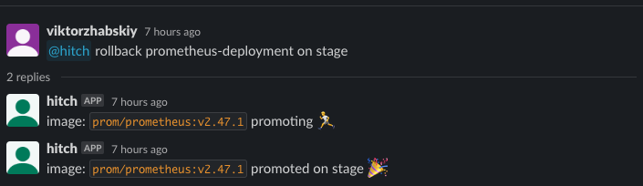

# Slackbot
Repo contains slack bot. You can add it in slack channel and work with your k8s clusters

----
## Dependencies
* Slack bot api, bot tokens
* GitHub flux infra repo
* k8s clusters with flux
----
## Requirements
First you need create all credentials to work with external dependencies.

Setup below env variables 
```dotenv
export SLACK_BOT_TOKEN=<xoxb-...>
export SLACK_APP_TOKEN=<xapp-...>
export GITHUB_API_TOKEN=<github_token>
export SERVICE_CONFIG_FILE_PATH=<path_to_config>
```

Configure slack bot [config](config.example.yaml) file which you can to indicate in SERVICE_CONFIG_FILE_PATH
```yaml
clusters: # list of clusters
  prod: # cluster name should be same like folder name in flux repo
    file: "/Users/viktor/.kube/config" # path to kube config for connect to cluster
  stage: # cluster name should be same like folder name in flux repo
    file: "/Users/viktor/.kube/config" # path to kube config for connect to cluster

bot: # related to slack to settings
  admins: # users who have permissions on user bot inside slack
    - "viktorzhabskiy"

namespaces: # list of watching namespaces in clusters 
  - "podinfo" # ns name
  
repo: # config for github. Set work repo and branch
  owner: "ViktorDevOpsCourse"
  name: "flux-image-updates" # repo name
  branch: "main" # work branch, changes from this branch apply for clusters
```
----
## Run
To run it in local machine 
```go
go run main.go
```
---
## How it work

Bot accept actions into slack channel. Base on that action creating a job to provide that action. Job have access to all clusters 
and applications on different namespaces. Main point it's deploy your applications via `Deployment` k8s resources, because bot watch 
on deployments and track it automatically. 

```yaml
apiVersion: apps/v1
kind: Deployment
metadata:
  name: podinfo # application name inside service
```

**podinfo** - we use it like application name inside service and track and detect applications git `deployment.GetName()`

**@botName** - name for your bot, you setted it when created bot inside slack 

### List
Return list of apps on all clusters with status and version
```
@botName list
```



**Flow:** 




### Diff
Return difference between `stage` and other your clusters. returning only difference fields. 
`stage` - cluster which will be compare with all other
```
@botName diff stage
```



**Flow:**



### Promote
Deploying your application on cluster which you want
```
@botName promote podinfo@7.0.0 to prod
```

`podinfo` - service name. !important it should be the same like in deployment manifest `metadata.name`

`@` - separator

`7.0.0` - version helm pkg for service

`prod` - name you environment/cluster. !important should be the same like in config bot file `SERVICE_CONFIG_FILE_PATH` clusters list



**Flow:**



### Rollback
Like promote but deploying last success deployment version
```
@botName rollback prometheus-deployment on stage
```
`prometheus-deployment` - service name. !important it should be the same like in deployment manifest `metadata.name`

`stage` - name you environment/cluster. !important should be the same like in config bot file `SERVICE_CONFIG_FILE_PATH` clusters list



## Main system components
`bot` - provide interface to work with slack. Accept events and processing it

`k8s service` - contain all applications from, clusters which are specified in the configuration, for specified namespaces.

`k8s controller` - watch for deployments in clusters. Adding, Updating, Deleting applications into/from k8s service

`job` - component which do all job for specified action. Get from k8s service clusters/apps, checking statuses for promote/rollback,
returning response to a user

`dispatcher` - controlling/creating job for specified action with args. Accepting slack bot action

`storage` - in memory repository with 2 data `events` - use for tracking bot actions and sync it with job. 
`state` - store last success deployment for application on cluster

`delivery` - implement github client which modify flux repo files to call flux reconciliation