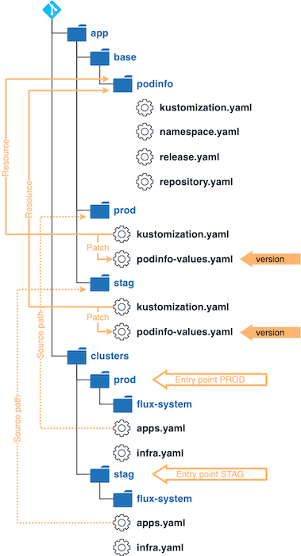

# flux-monorepo

For this example we assume a scenario with two clusters: staging and production.
The end goal is to leverage Flux and Kustomize to manage both clusters while minimizing duplicated declarations.

We will configure Flux to install, test and upgrade a demo app Podinfo using `HelmRepository` and `HelmRelease` custom resources.
Flux will monitor the Helm repository, and it will automatically upgrade the Helm releases to their latest chart version based on [semver](https://semver.org/) ranges.

On each cluster, we will install [Weave GitOps](https://docs.gitops.weave.works/) (the OSS UI for Flux) to visualize and monitor the workloads managed by Flux.

## Prerequisites

You will need a Kubernetes cluster version 1.21 or newer.
For a quick local test, you can use [Kubernetes kind](https://kind.sigs.k8s.io/docs/user/quick-start/).
Any other Kubernetes setup will work as well though.

Install the Flux CLI on MacOS or Linux using Homebrew:

```sh
brew install fluxcd/tap/flux
```

## Repository structure



The Git repository contains the following top directories:

- `apps` dir contains Helm releases with a custom configuration per cluster
- `infra` dir contains common infra tools such as ingress-nginx and cert-manager
- `clusters` dir contains the Flux configuration per cluster

```
├── apps
│   ├── base
│   ├── prod 
│   └── stag
├── infra
│   ├── confs
│   └── ctrls
└── clusters
    ├── prod
    └── stag
```

### Applications

In order to follow the guide you'll need a GitHub account and a personal access token that can create repositories (check all permissions under repo).

The apps configuration is structured into:

- `apps/base/` dir contains namespaces and Helm release definitions
  - `apps/base/podinfo/` dir contains a Flux `HelmRelease` with common values for both clusters
- `apps/prod/` dir contains the production Helm release values
- `apps/stag/` dir contains the staging values

```
./apps/
├── base
│   └── podinfo
│       ├── kustomization.yaml
│       ├── namespace.yaml
│       ├── release.yaml
│       └── repository.yaml
├── prod
│   ├── kustomization.yaml
│   └── podinfo-patch.yaml
└── stag
    ├── kustomization.yaml
    └── podinfo-patch.yaml
```

### Infrastructure

The infrastructure is structured into:

- **infrastructure/controllers/** dir contains namespaces and Helm release definitions for Kubernetes controllers
- **infrastructure/configs/** dir contains Kubernetes custom resources such as cert issuers and networks policies

```
./infra/
├── confs
│   ├── cluster-issuers.yaml
│   ├── network-policies.yaml
│   └── kustomization.yaml
└── ctrls
    ├── cert-manager.yaml
    ├── ingress-nginx.yaml
    ├── weave-gitops.yaml
    └── kustomization.yaml
```

## Bootstrap staging and production

The clusters dir contains the Flux configuration:

```
./clusters/
├── prod
│   ├── apps.yaml
│   └── infrastructure.yaml
└── stag
    ├── apps.yaml
    └── infrastructure.yaml
```

Export your GitHub access token, username and repo name:

```sh
export GITHUB_TOKEN=<your-token>
export GITHUB_USER=<your-username>
export GITHUB_REPO=<repository-name>
```

**Execute `make start`.** This command will create a cluster KinD and commit manifests for Flux components to `clusters/stag/flux-system` and `clusters/prod/flux-system` directories, create a read-only deployment key on GitHub so that it can make changes internally cluster.

Check if the Podinfo demo application can be accessed via ingress using `make test`

### Access the Flux UI

To access the Flux UI on a cluster, first start port forwarding with:

```sh
kubectl -n flux-system port-forward svc/weave-gitops 9001:9001
```

Navigate to <http://localhost:9001> and login using the username `admin` and the password `flux`.

[Weave GitOps](https://docs.gitops.weave.works/) provides insights into your application deployments,
and makes continuous delivery with Flux easier to adopt and scale across your teams.
The GUI provides a guided experience to build understanding and simplify getting started for new users;
they can easily discover the relationship between Flux objects and navigate to deeper levels of information as required.

You can change the admin password bcrypt hash in `infra/ctrls/weave-gitops.yaml`.
To generate a bcrypt hash please see Weave GitOps
[documentation](https://docs.gitops.weave.works/docs/configuration/securing-access-to-the-dashboard/#login-via-a-cluster-user-account).

Note that on production systems it is recommended to expose Weave GitOps over TLS with an ingress controller and
to enable OIDC authentication for your organisation members.
To configure OIDC with Dex and GitHub please see this [guide](https://docs.gitops.weave.works/docs/guides/setting-up-dex/).

## Add clusters

**Not working yet!** If you want to add a cluster to your fleet, execute `make add-cluster`.
